# android-bike-radar-overlay

<p align="left">
  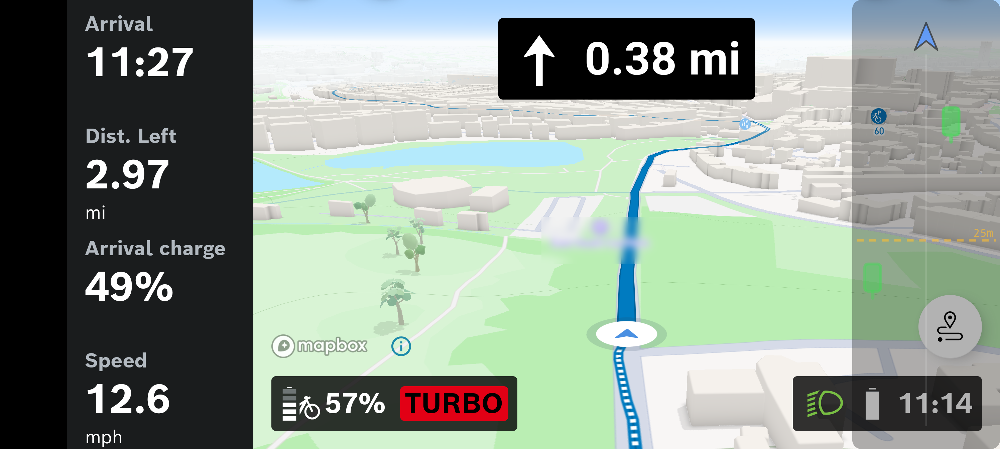
</p>

The app is the faint strip down the right edge of the screenshot above
- the radar threat ladder, plus small battery indicators for the radar
itself and the front camera. It draws on top of whatever you're already
running (a map, Bosch Flow, etc.) and beeps when a car closes in behind
you. The beep tier rises as the closest vehicle gets nearer; a distinct
urgent tone fires if an impact looks imminent.

Everything else in the screenshot - the navigation panel on the left,
the assist-mode and battery row along the bottom - is other apps
showing through. The overlay only ever draws the right-edge strip; the
rest of your screen stays yours.

Map tiles in the screenshot are rendered by a separate navigation app
underneath the overlay. Map tiles &copy; Mapbox, map data &copy;
OpenStreetMap contributors. The visible eBike assist-mode indicator
("TURBO") is part of the Bosch eBike Flow UI; Bosch and eBike Flow are
trademarks of Robert Bosch GmbH and their incidental appearance here
does not imply any endorsement.

The app speaks the V2 (bonded) BLE rear-radar protocol. See
[`PROTOCOL.md`](https://github.com/partymola/bike-radar-docs/blob/main/PROTOCOL.md)
and the companion [`bike-radar-docs`](https://github.com/partymola/bike-radar-docs)
repository for the wire protocol, reference decoder, and unit tests.

*¿Hablas español? Hay un resumen [en español](#en-español) al final.*

## Features

- Live radar overlay with per-vehicle distance, closing speed and
  lateral position; per-tier audio cues plus a separate urgent-impact
  tone.
- Optional directional alert audio: in landscape, beeps pan to the
  threat's lateral side on the phone's built-in speakers, and on stereo
  headphone-class routes (BT, BLE, wired, USB, hearing aid).
- Home Assistant integration via MQTT discovery: radar and dashcam
  batteries, front-light mode, close-pass event entity, end-of-ride
  summary (distance, close-pass count, closing speeds, lateral
  clearances).
- Front-camera light auto-mode: picks Day Flash before sunset, Night
  Flash after, computed from the device location (London fallback if
  the location permission is denied). A manual button press during the
  session wins for the rest of the ride.
- Radar tail-light auto-mode: sets the rear radar's tail light to a day
  mode (default Day Flash) before sunset and a night mode (default Night
  Flash) after, from the same device location. Sets the mode by type, so
  it leaves your radar's button-cycle configuration untouched; a manual
  button press wins for the rest of the ride. Off by default.
- Bosch eBike live data (read-only): subscribes to the Smart System
  proprietary status-notify characteristic while Bosch Flow is
  active and decodes the scalar datapoints it carries (speed,
  cadence, rider and motor power, battery state of charge,
  odometer, assist mode, etc.). Never writes the bike's command
  channel.
- Walk-away alarm: chirps a forgotten dashcam if it stays awake past
  the rider's leaving window after a parked-and-locked bike state.
- Optional per-ride capture log (off by default; enable on the Debug
  screen) written to app-private storage: radar packets, BLE
  characteristic notifications, phone-battery trace, and decoder
  events; useful for post-ride replay and bug reports.

## App screens

<p align="left">
  
  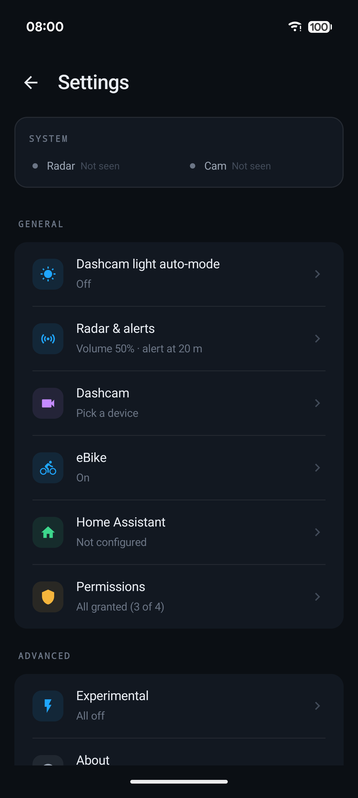
  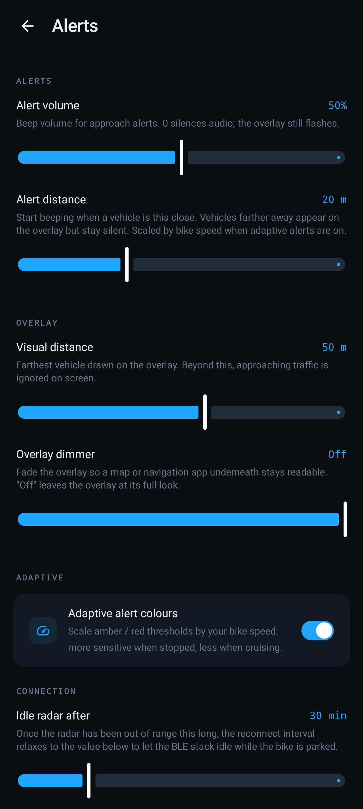
  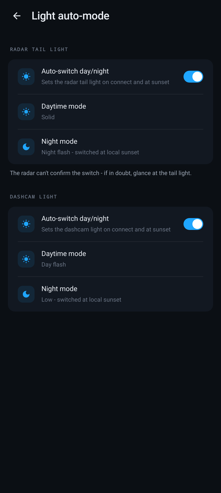
  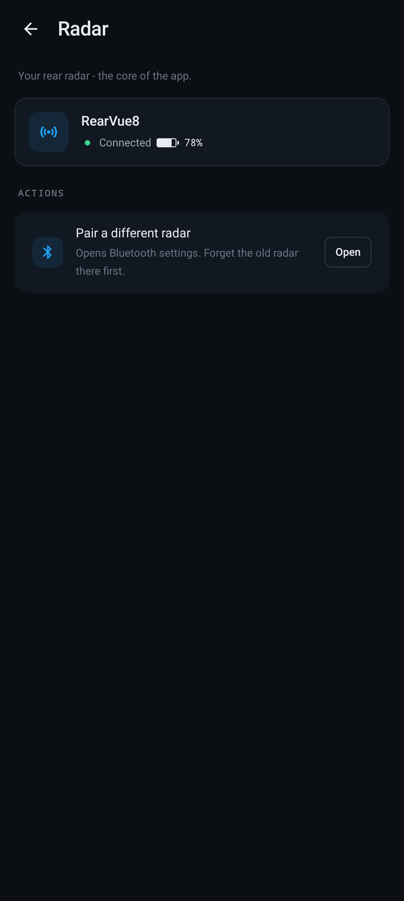
  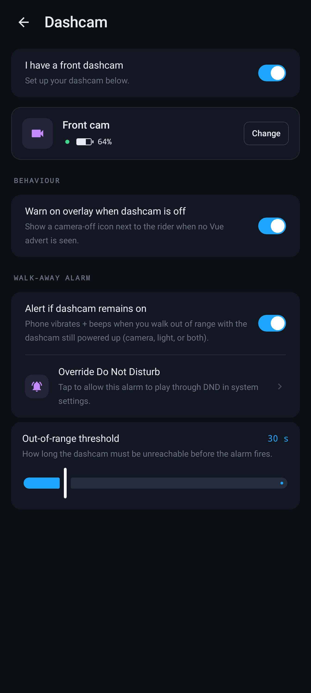
  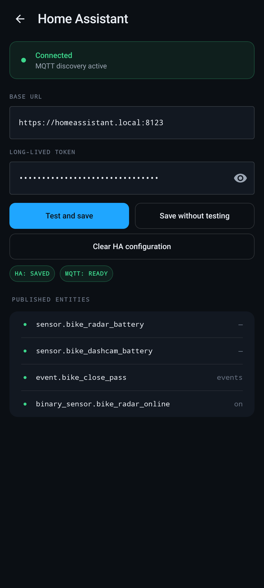
  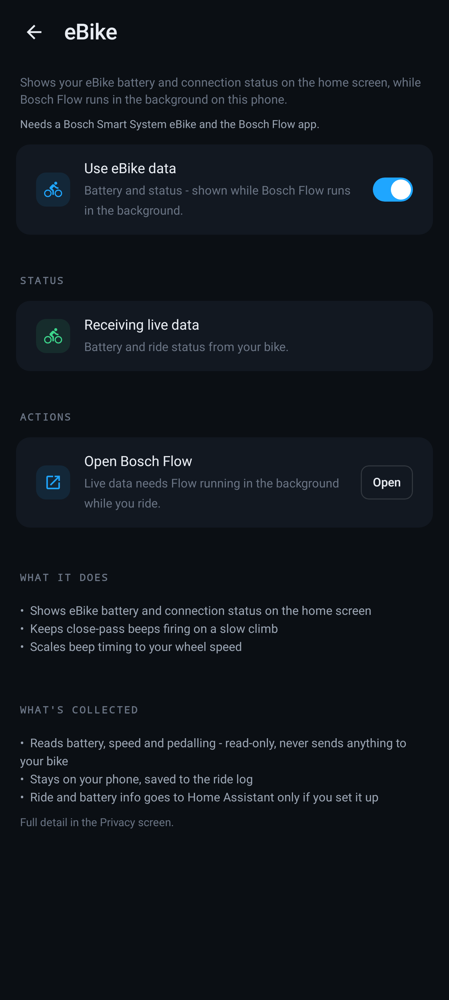
  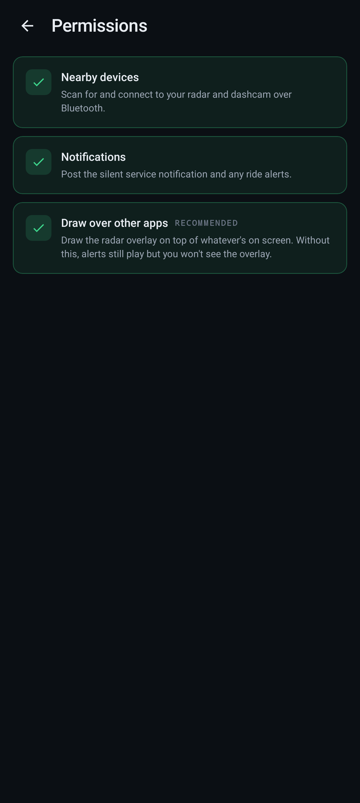
  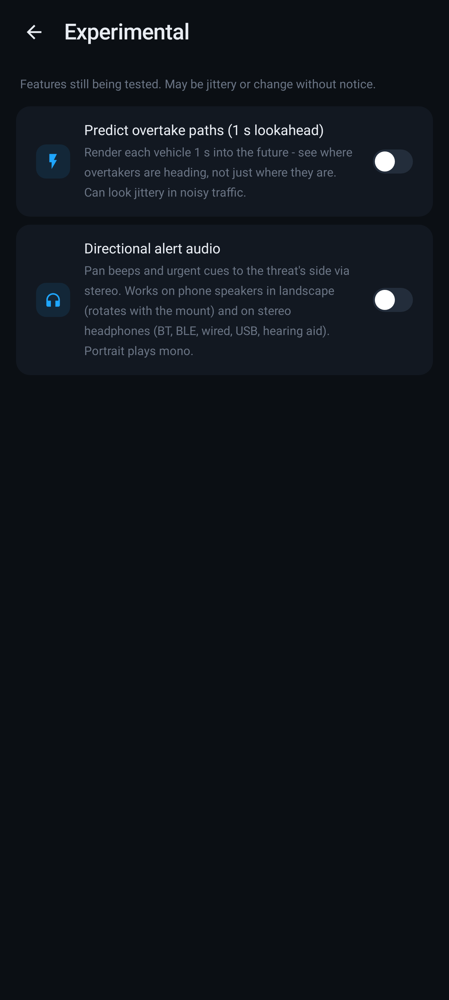
  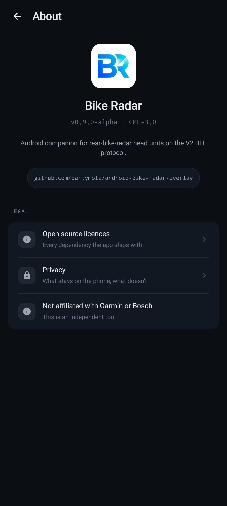
  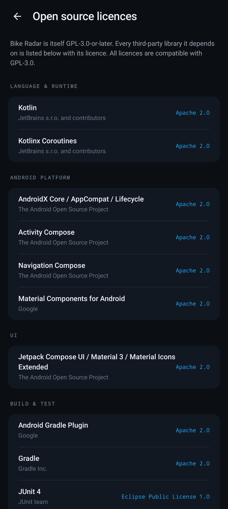
  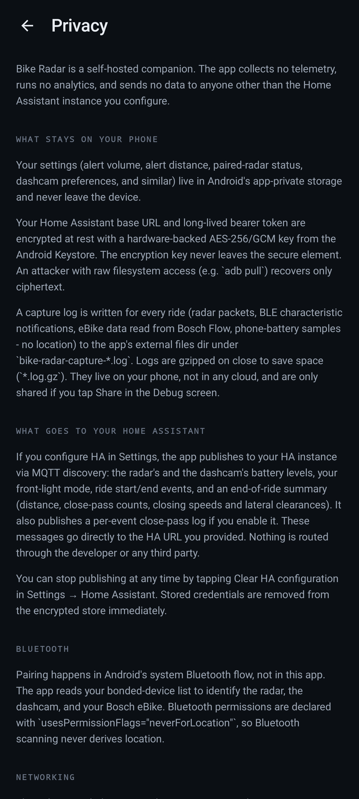
</p>

Debug screen is hidden behind a three-tap long-press unlock on the app title.

## Status

Alpha. Personal project. Tested only against the author's own hardware
(Garmin Varia RearVue 820 + Pixel 10 Pro XL on Android 16). No
guarantee it works on any other device, any other Android version, or
any future firmware.

## Use at your own risk

This app displays rear-radar information intended to supplement, not
replace, rear observation. It is not a replacement for a rear-view
mirror, direct observation, or safe riding practice. Treat anything
shown on the overlay as advisory only, and never rely on it alone for
safety-critical decisions. Always shoulder-check before manoeuvring.

The optional eBike status feature is read-only: it passively listens to
data your Bosch eBike already broadcasts while the Bosch Flow app is
connected, and never sends any command to the bike.

The GPL-3.0 licence (see `LICENSE`) disclaims warranty to the extent
permitted by applicable law. Not affiliated with or endorsed by
Garmin or Bosch. Bug reports welcome; please include device + Android
version + firmware.

## Requirements

- Android phone (tested on Pixel 10 Pro XL / Android 16). `minSdk = 31`,
  `targetSdk = 36`.
- A rear-radar BLE head unit that speaks the V2 (bonded) protocol. V2
  requires a one-time LE Secure Connections pair via Android's own
  Bluetooth settings; the app does not attempt `createBond()` itself.
  (Legacy V1 (cleartext) frames the radar emits unsolicited are
  ignored; the app never subscribes the V1 channel.)
- Optional: Home Assistant for battery reporting and close-pass
  logging. See below for the bare-minimum HA-side set-up; the radar
  overlay works standalone without it.

## Home Assistant prerequisites (optional)

If you want the app to push radar + dashcam battery and close-pass
events into HA, the HA side needs:

1. An MQTT broker reachable from HA - e.g. the official
   [Mosquitto add-on](https://www.home-assistant.io/integrations/mqtt/)
   on HA OS / Supervised, or any external broker.
2. HA's MQTT integration enabled and connected to that broker
   (**Settings → Devices & Services → Add Integration → MQTT**).
3. A long-lived access token for the account you want the app to
   act as (**user profile → Security → Long-lived access tokens**).

No extra configuration is required beyond that - the app publishes
via MQTT Discovery on HA's default `homeassistant/` prefix, so
entities appear automatically. Dashboards, automations and
Grafana/InfluxDB are up to you.

If the MQTT broker or the MQTT integration is missing, HA pushes
silently no-op. The in-app "Test and save" button surfaces this.

## Build

Builds run in Docker so the host only needs `adb`:

```bash
docker build -t bike-radar-builder .
docker run --rm \
  -v "$PWD:/workspace" -u "$(id -u):$(id -g)" \
  -v "$HOME/.cache/bike-radar-gradle:/gradle-cache" \
  -e GRADLE_USER_HOME=/gradle-cache \
  -w /workspace bike-radar-builder \
  gradle assembleDebug --console=plain --no-daemon

adb install -r app/build/outputs/apk/debug/app-debug.apk
```

The first build generates `debug.keystore` at the repo root (gitignored)
and reuses it across rebuilds so `adb install -r` keeps working.

## First run

1. Grant the requested permissions (Bluetooth scan, Bluetooth connect,
   notifications, overlay).
2. Enter your Home Assistant base URL and long-lived token (or skip).
3. Pair your rear radar via Android's **Settings -> Connected devices ->
   Pair new device** while the radar is in pair mode. The app detects
   the bond automatically and starts tracking.

## Translating

The UI is fully externalised into Android string resources, so it can be
translated without touching code - Spanish ships in
[`values-es`](app/src/main/res/values-es/strings.xml). To add a language,
fork, create `app/src/main/res/values-<code>/strings.xml`, translate the
text between the tags, and open a PR. Full instructions (placeholders,
plurals, what CI checks) are in [`CONTRIBUTING.md`](CONTRIBUTING.md).

## Install

Signed APKs are attached to every [GitHub Release](../../releases).
Download the latest APK and install it, or - to get updates
automatically - add this repository to
[Obtainium](https://github.com/ImranR98/Obtainium): paste the repo URL
into *Add App* and enable "Include prereleases" while the app is in
alpha. Each install is signed with the same key, so updates apply over
the top without uninstalling.

Store-listing metadata lives under `fastlane/metadata/android/`
(en-US + es-ES) in the standard fastlane structure that catalogues read.

## Releases

Signed APKs are published as GitHub Releases when a tag matching
`v*` is pushed. The release workflow builds from a clean checkout,
signs with a release keystore held as repo secrets, and attaches
the APK to the Release. While the app is in alpha every release is
published as a prerelease; the flag is hardcoded in the workflow and
will be removed when the app ships a stable tag.

To cut a release:

```bash
# Bump versionCode / versionName in app/build.gradle.kts, commit.
git tag vX.Y.Z
git push origin vX.Y.Z
```

The workflow needs these GitHub repo secrets to exist:

- `ANDROID_KEYSTORE_BASE64` - the release keystore, base64-encoded
- `ANDROID_KEYSTORE_PASSWORD` - keystore password
- `ANDROID_KEY_ALIAS` - key alias inside the keystore
- `ANDROID_KEY_PASSWORD` - key password

Local release builds pick the same env variables up from the
shell (with `ANDROID_KEYSTORE_PATH` pointing at the keystore
file on disk) and otherwise fall back to the debug signing config
so the `release` variant can still be built for inspection
without the production key.

## En español

**Bike Radar** es una app de Android que te avisa del tráfico que tienes
detrás usando el radar trasero de tu bici. Dibuja una barra lateral en el
borde de la pantalla, encima de cualquier app que tengas abierta (un mapa,
Bosch Flow, etc.), y pita cuando se acerca un coche. El número de pitidos
aumenta según se aproxima, y suena un aviso distinto si el impacto parece
inminente.

La app está totalmente traducida al español. Si tu teléfono está en español,
Bike Radar se mostrará en español automáticamente. Si prefieres usar solo
esta app en español con el teléfono en otro idioma, puedes hacerlo desde los
ajustes de idioma por aplicación de Android (Android 13 o posterior).

<p align="left">
  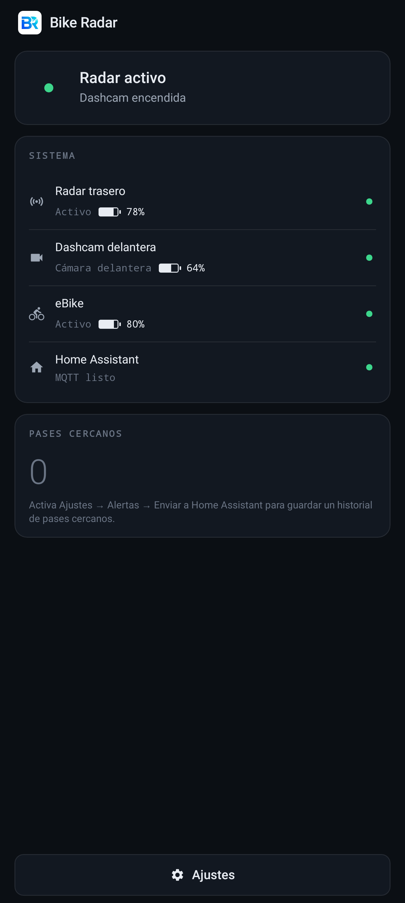
</p>

Funciones principales:

- Radar en pantalla con la distancia, la velocidad de aproximación y la
  posición lateral de cada vehículo; pitidos por nivel y un aviso urgente
  distinto para impacto inminente.
- Integración opcional con Home Assistant por MQTT: batería del radar y de
  la cámara, modo de la luz delantera, eventos de pase cercano y resumen de
  fin de ruta (distancia, número de pases, velocidades de aproximación y
  holguras laterales).
- Luz delantera y luz trasera del radar en modo automático según el
  atardecer local.
- Datos en vivo de la eBike Bosch (solo lectura) mientras Bosch Flow está
  activo: velocidad, cadencia, potencia, batería, etc. Nunca envía nada a la
  bici.
- Aviso de cámara olvidada: te avisa si la dashcam sigue encendida cuando te
  alejas de la bici después de aparcarla.

El radar funciona por sí solo; Home Assistant y la eBike son opcionales.

## License

GPL-3.0-or-later. See [`LICENSE`](./LICENSE).
