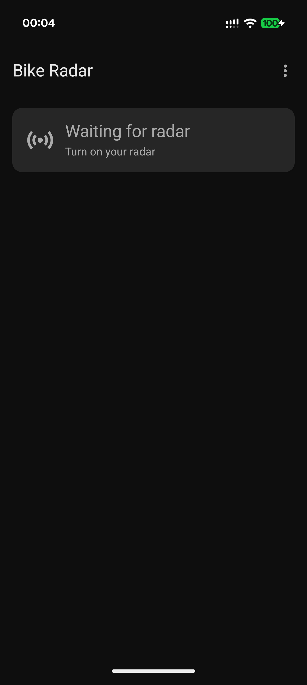
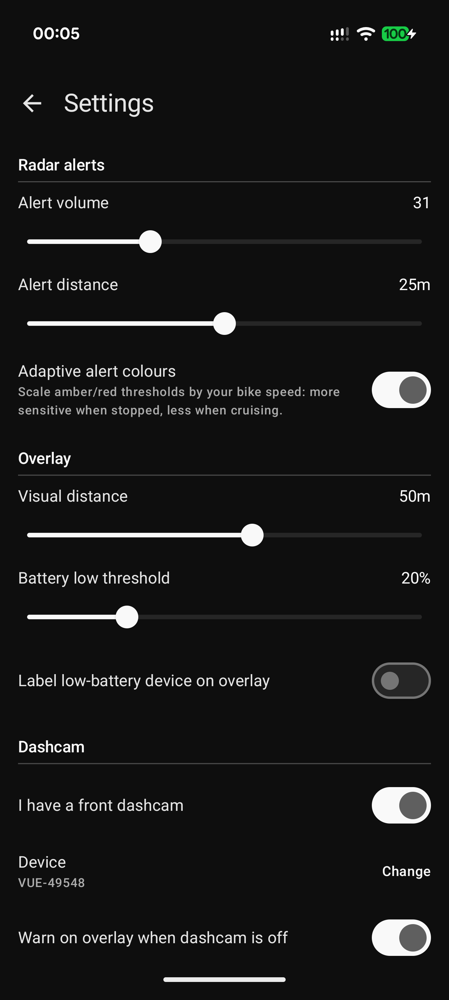
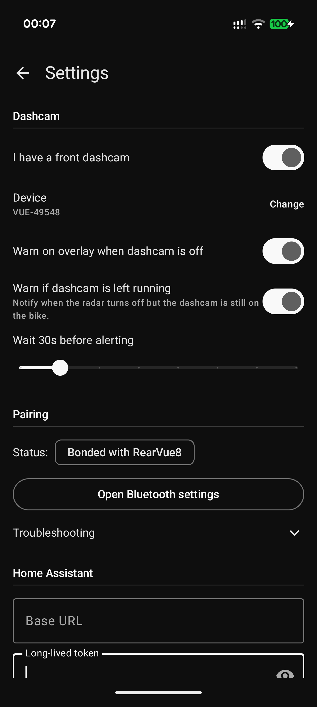
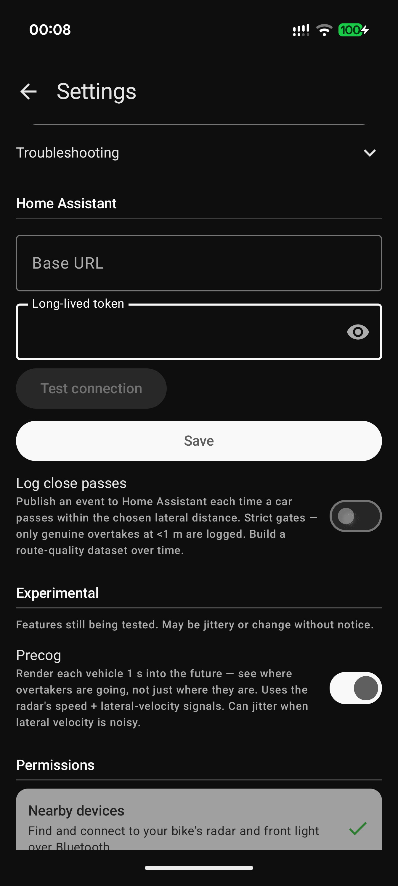
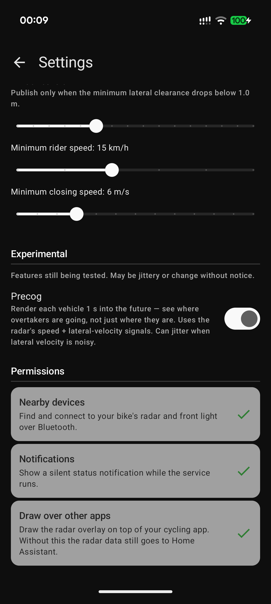
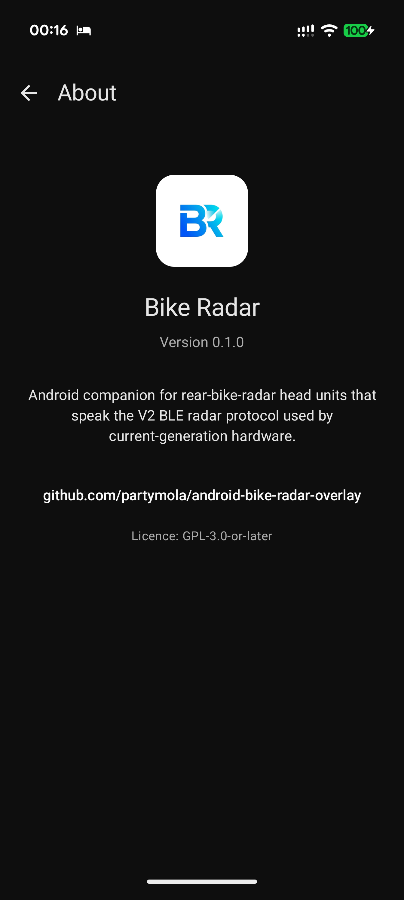
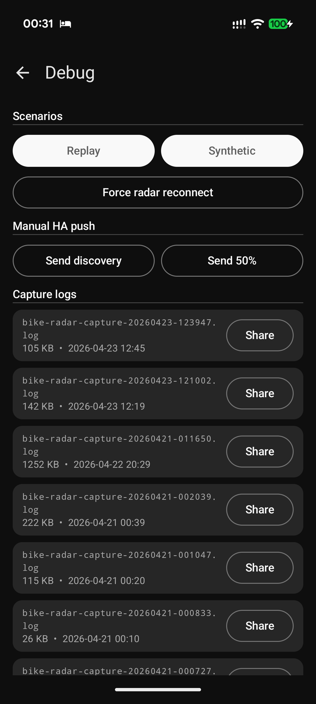
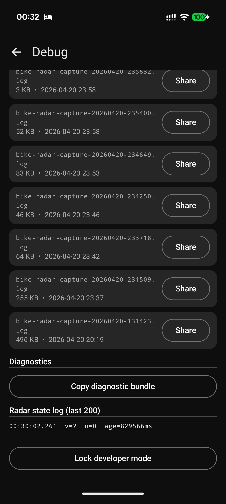

# android-bike-radar-overlay

Android companion for a rear-bike-radar head unit that speaks the common
V1 (cleartext) and V2 (bonded) BLE radar protocols. Reads
battery levels from the front camera and rear radar over BLE, publishes
them to Home Assistant via MQTT, and draws a live radar overlay during
rides.

See [`PROTOCOL.md`](https://github.com/partymola/bike-radar-docs/blob/main/PROTOCOL.md)
and the companion [`bike-radar-docs`](https://github.com/partymola/bike-radar-docs)
repository for the wire protocol, reference decoders, and unit tests.

## Screenshots

<p align="left">
  
  
  
  
  
  
  
  
</p>

Static UI screenshots; live radar overlay screenshots coming soon.
Debug screen is hidden behind a three-tap long-press unlock on the app title.

## Status

Alpha. Personal project. Tested only against the author's own hardware
(Garmin Varia RearVue 820 + Pixel 10 Pro XL on Android 16). No
guarantee it works on any other device, any other Android version, or
any future firmware.

## Use at your own risk

This app displays rear-radar information intended to supplement, not
replace, rear observation. It is not a replacement for a rear-view
mirror, direct observation, or safe riding practice. Treat anything
shown on the overlay as advisory only, and never rely on it alone for
safety-critical decisions. Always shoulder-check before manoeuvring.

The GPL-3.0 licence (see `LICENSE`) disclaims warranty to the extent
permitted by applicable law. Not affiliated with or endorsed by
Garmin. Bug reports welcome; please include device + Android version
+ firmware.

## Requirements

- Android phone (tested on Pixel 10 Pro XL / Android 16). `minSdk = 31`,
  `targetSdk = 34`.
- A rear-radar BLE head unit that speaks V1 (cleartext) or V2 (bonded).
  V2 requires a one-time LE Secure Connections pair via Android's own
  Bluetooth settings; the app does not attempt `createBond()` itself.
- Optional: a Home Assistant instance with the MQTT integration enabled.
  Without HA the radar overlay still works; battery pushes silently no-op.

## Build

Builds run in Docker so the host only needs `adb`:

```bash
docker build -t bike-radar-builder .
docker run --rm \
  -v "$PWD:/workspace" -u "$(id -u):$(id -g)" \
  -v "$HOME/.cache/bike-radar-gradle:/gradle-cache" \
  -e GRADLE_USER_HOME=/gradle-cache \
  -w /workspace bike-radar-builder \
  gradle assembleDebug --console=plain --no-daemon

adb install -r app/build/outputs/apk/debug/app-debug.apk
```

The first build generates `debug.keystore` at the repo root (gitignored)
and reuses it across rebuilds so `adb install -r` keeps working.

## First run

1. Grant the requested permissions (Bluetooth scan, Bluetooth connect,
   notifications, overlay).
2. Enter your Home Assistant base URL and long-lived token (or skip).
3. Pair your rear radar via Android's **Settings -> Connected devices ->
   Pair new device** while the radar is in pair mode. The app detects
   the bond automatically and starts tracking.

## License

GPL-3.0-or-later. See [`LICENSE`](./LICENSE).
