# Bike Radar

**Use any cycling app. Add radar on top.** Bike Radar is a free, open-source
Android app that draws your rear bike radar as a live overlay and audio alerts
over whatever you're already running - Strava, Komoot, Google Maps, Bosch
Flow, your music. As far as we know it's the only radar app that draws over
other apps, and the only open-source one. No account, no ads, no tracking.

[](../../actions/workflows/ci.yml)
[](../../releases/latest)
[](./LICENSE)
[](#requirements)

**[⬇ Download the latest APK](../../releases/latest)** - or add the repo to
[Obtainium](https://github.com/ImranR98/Obtainium) for automatic updates.

Built and ridden daily by the author for months on a Garmin Varia RearVue
820 - a commute tool, not a demo. It works with Garmin Varia radars over
Bluetooth LE: everything on the 820, range only on the earlier models (see
[device compatibility](#compatibility)). Not affiliated with or endorsed by
Garmin. On the 820 it shows more than the official apps do, because the
per-vehicle lateral position and speed feed the overlay and the close-pass
counting.

<p align="left">
  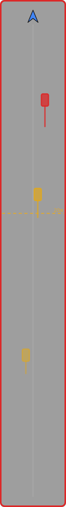
</p>

The app is the faint strip down the right edge of the screenshot above
- the radar threat ladder, plus small battery indicators for the radar
itself and the front camera. It beeps when a car closes in behind you;
the beep tier rises as the closest vehicle gets nearer, and a distinct
urgent tone fires if an impact looks imminent. Everything else in the
screenshot - the navigation panel, the assist-mode and battery row - is
other apps showing through. The overlay only ever draws the right-edge
strip; the rest of your screen stays yours. (*Image credits
[below](#credits).*)

*¿Hablas español? Hay un resumen [en español](#en-español) más abajo.*

## What it does

- **Radar overlay on any app.** A thin strip shows each vehicle behind
  you - distance, closing speed, and which side it's on - over your
  map, Bosch Flow, music, anything.
- **Alerts you don't have to look at.** Beeps rise in tiers as the
  closest car nears, a distinct urgent tone fires if an impact looks
  imminent, and a clear chime sounds when the road behind is empty.
- **Close-pass counting and ride history, all on your phone.** Counts
  the overtakes that pass close, notifies a post-ride summary, and
  keeps per-ride stats - distance, overtakes, close passes, how close
  and how fast the closest came - in app-private storage. No account,
  no location, no route.

<details><summary><b>More features</b></summary>

- Home Assistant integration via MQTT discovery: radar and dashcam
  batteries, front-light mode, close-pass event entity, end-of-ride
  summary (distance, close-pass count, closing speeds, lateral
  clearances).
- Front-camera light auto-mode: picks Day Flash before sunset, Night
  Flash after, computed from your location. Grant approximate location, or
  enter coordinates manually if you'd rather not (London fallback if you do
  neither). A manual button press during the session wins for the rest of
  the ride.
- Radar tail-light auto-mode: sets the rear radar's tail light to a day
  mode (default Day Flash) before sunset and a night mode (default Night
  Flash) after, from the same device location. Sets the mode by type, so
  it leaves your radar's button-cycle configuration untouched; a manual
  button press wins for the rest of the ride. Off by default.
- Bosch eBike live data (read-only): shows your eBike's live speed,
  cadence, rider and motor power, battery state of charge, odometer and
  assist mode while Bosch Flow is connected. Never writes to the bike.
- Walk-away alarm: chirps a forgotten dashcam if it stays awake past
  the rider's leaving window after a parked-and-locked bike state.
- Optional per-ride capture log (off by default; enable on the Debug
  screen) written to app-private storage: radar packets, BLE
  characteristic notifications, eBike telemetry from Bosch Flow,
  phone-battery trace, turn direction and rate from the motion sensors,
  and decoder events; useful for post-ride replay and bug reports. A
  second toggle extends the log back to the start of each connection, for
  a radar that never connects; that adds the connection steps and your
  radar's hardware identifiers, including its serial number.

</details>

## Compatibility

| Your radar | Works? |
|------------|--------|
| Garmin Varia RearVue 820 | ✅ Everything - tested daily |
| Garmin Varia RTL515 / RTL516 | ⚠️ Range only, expected (one report of no connection before 1.4.0) |
| Garmin Varia RVR315 | ⚠️ Range only, expected (unconfirmed) |
| Garmin Varia RCT715 / RCT716 | ⚠️ Range only, expected (unconfirmed) |
| Garmin Varia eRTL615 | ⚠️ Range only, expected (unconfirmed) |
| Garmin Varia RTL510 and older | ⚠️ Range only at best (unconfirmed); an ANT+-only unit cannot connect |
| Non-Garmin radars (Wahoo, Bryton, Magene, Trek, ...) | ❌ No - [why](COMPATIBILITY.md) |

**Why only the 820 gets everything.** The overlay needs each vehicle's
lateral position, closing speed and size. Garmin announced those as new on
the RearVue 820. Earlier radars are not expected to send them at all. On
those the app reads the older range-only stream instead. You get the
approach beeps, the all-clear, and overlay colours that show distance
instead of speed. You do not get the urgent warning or close-pass counting.
With a Bosch eBike the sound when the radar drops works from the bike, as
before. Without one it is expected to fire only if the radar was still seeing
traffic behind you shortly before the link died, because the radar cannot
report your own speed and recent traffic is what tells the app you are still
riding; on an
empty road it stays silent. You can turn that substitute off in
**Settings → Experimental**. That fallback is new in 1.4.0 and nobody has
confirmed it on real hardware yet.

Riding anything but an 820? A works or doesn't-work
[report](../../issues) is the most valuable thing you can send. The Debug
screen records what your radar offered, which makes it far more useful. If
the app does not spot your radar by name, pick it in **Settings → Radar**.
Front camera, eBike, Android versions and the reason behind each row are in
[`COMPATIBILITY.md`](COMPATIBILITY.md).

## App screens

<p align="left">
  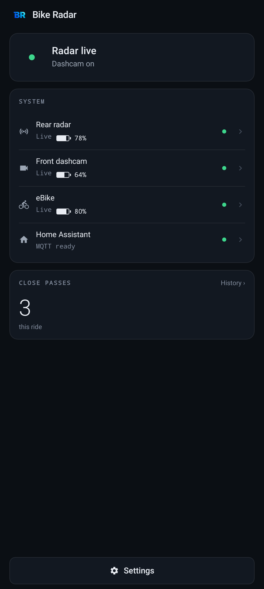
  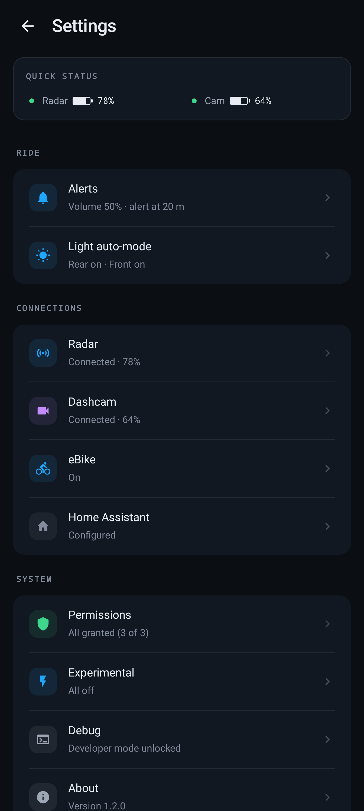
  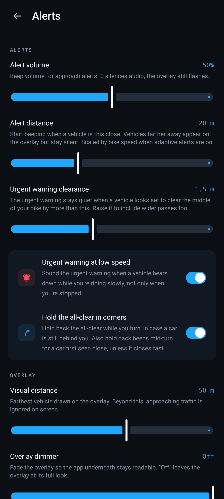
  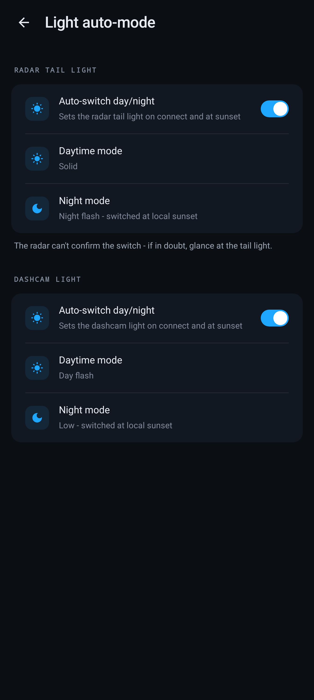
  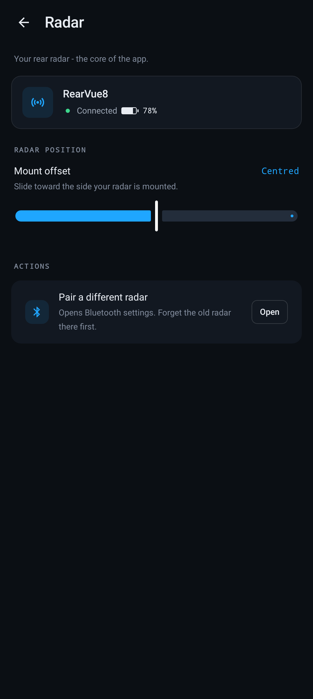
  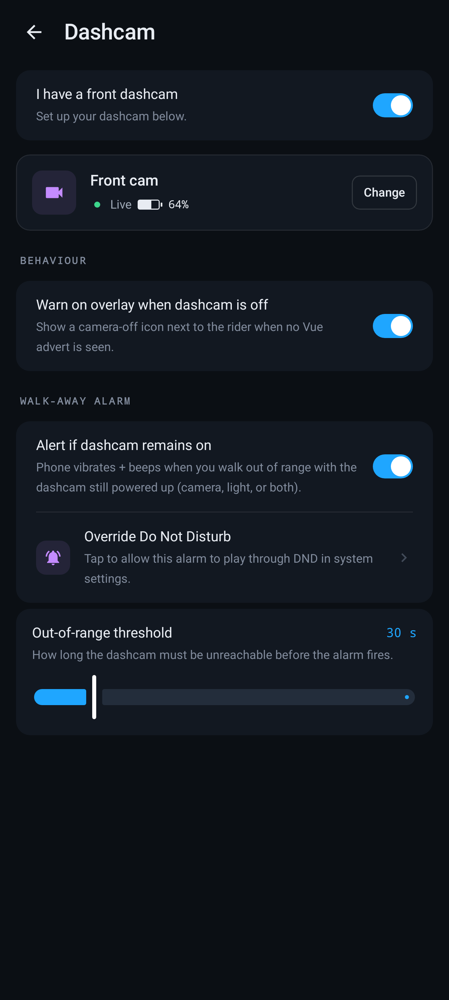
  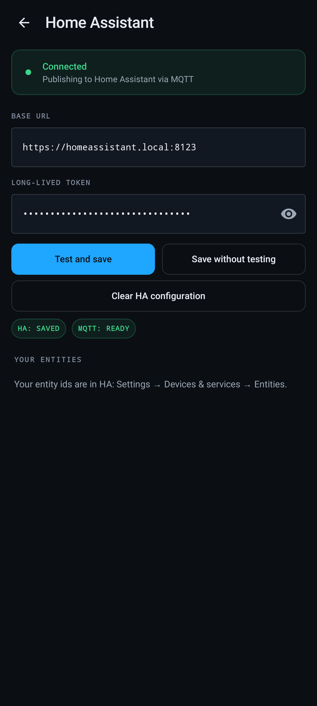
  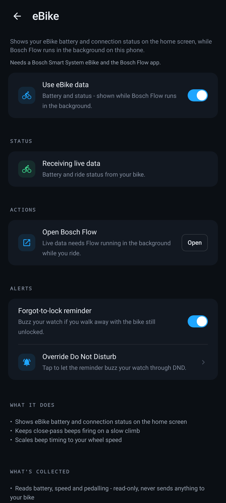
  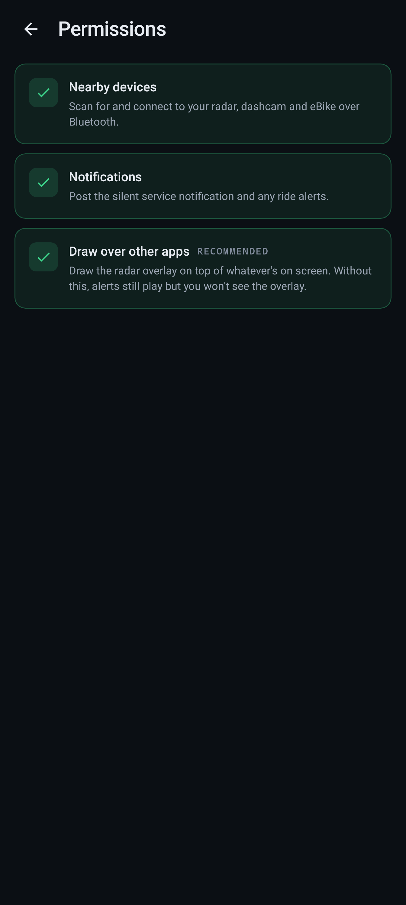
  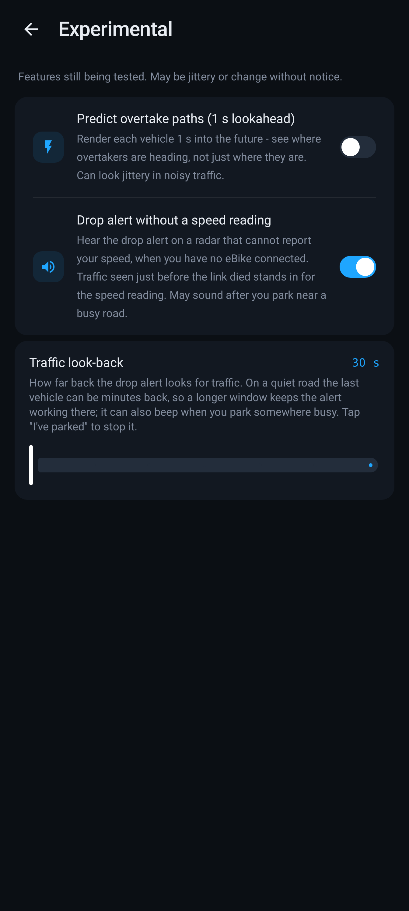
  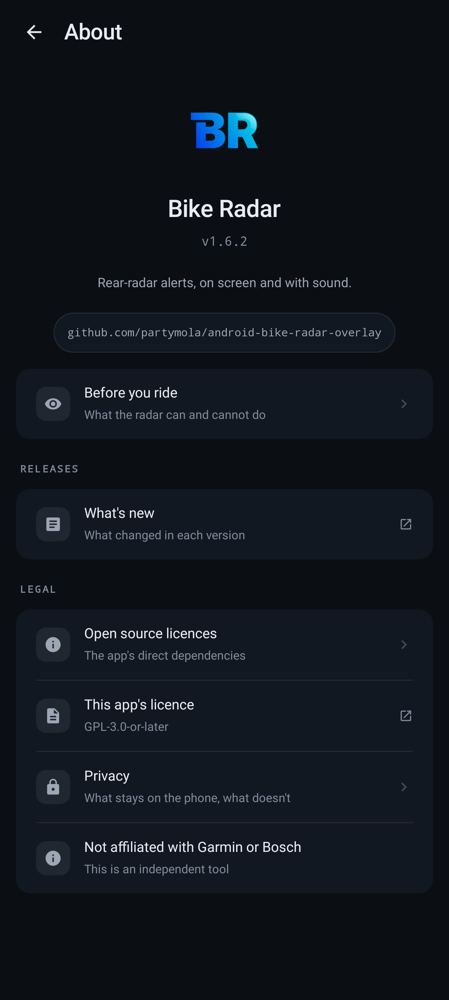
  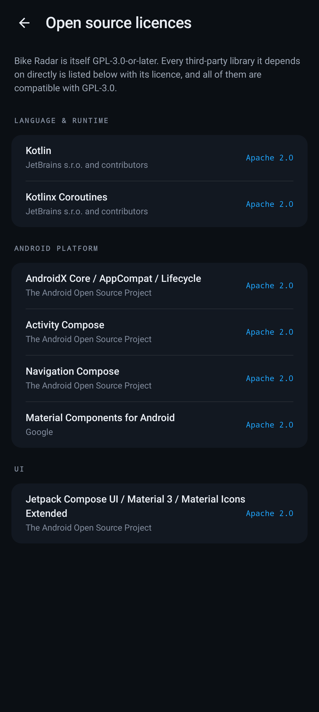
  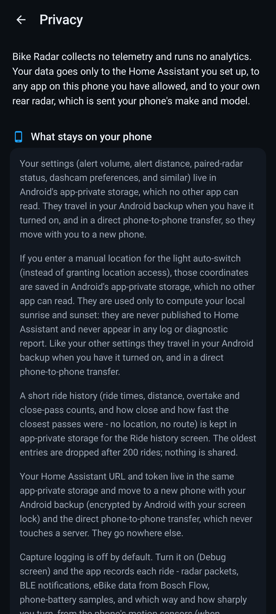
</p>

Debug screen is hidden behind a three-tap long-press unlock on the app title.

## Install

Signed APKs are attached to every [GitHub Release](../../releases).
Download the latest APK and install it, or - to get updates
automatically - add this repository to
[Obtainium](https://github.com/ImranR98/Obtainium): paste the repo URL
into *Add App*. Each install is signed with the same key, so updates apply over
the top without uninstalling.

Store-listing metadata lives under `fastlane/metadata/android/`
(en-US + es-ES) in the standard fastlane structure that catalogues read.

## First run

1. Grant the requested permissions (Bluetooth scan, Bluetooth connect,
   notifications, overlay).
2. Enter your Home Assistant base URL and long-lived token (or skip).
3. Pair your rear radar via Android's **Settings -> Connected devices ->
   Pair new device** while the radar is in pair mode. The app detects
   the bond automatically and starts tracking. If it doesn't recognise
   your radar by name, pick it from your paired devices in **Settings ->
   Radar**.

## Requirements

- Android phone (tested on Pixel 10 Pro XL / Android 16). `minSdk = 31`,
  `targetSdk = 36`.
- A rear radar from the Garmin Varia BLE family (see
  [`COMPATIBILITY.md`](COMPATIBILITY.md)) speaking the V2 (bonded)
  protocol. V2 requires a one-time LE Secure Connections pair via
  Android's own Bluetooth settings; the app does not attempt
  `createBond()` itself. A radar whose service table has no V2
  characteristic at all can fall back to the legacy cleartext stream, which
  carries range and nothing else: proximity beeps and the all-clear work,
  the urgent warning and close-pass logging cannot. A radar that does have
  the V2 characteristic never gets the legacy subscribe, whatever the
  handshake does.
- Optional: Home Assistant for battery reporting and pushing close-pass
  and ride-summary events off the phone. See below for the bare-minimum
  HA-side set-up; the overlay, close-pass counting and ride history all
  work standalone without it.

## Home Assistant prerequisites (optional)

If you want the app to push radar + dashcam battery and close-pass
events into HA, the HA side needs:

1. An MQTT broker reachable from HA - e.g. the official
   [Mosquitto add-on](https://www.home-assistant.io/integrations/mqtt/)
   on HA OS / Supervised, or any external broker.
2. HA's MQTT integration enabled and connected to that broker
   (**Settings → Devices & Services → Add Integration → MQTT**).
3. A long-lived access token for the account you want the app to
   act as (**user profile → Security → Long-lived access tokens**).

No extra configuration is required beyond that - the app publishes
via MQTT Discovery on HA's default `homeassistant/` prefix, so
entities appear automatically. Dashboards, automations and
Grafana/InfluxDB are up to you.

If the MQTT broker or the MQTT integration is missing, HA pushes
silently no-op. The in-app "Test and save" button surfaces this.

## Troubleshooting & FAQ

**The radar shows as disconnected while I'm using the manufacturer's
app.** That's expected. The radar accepts one Bluetooth connection at a
time, so while the vendor's own app (for firmware updates, settings, or
registration) holds the link, this app cannot connect and shows the
radar as dropped. Finish in the vendor app - firmware updates in
particular should never be interrupted - then close it, and this app
reconnects on its own within a few seconds.

**I didn't ride for a few months and now the app is dead.** Android
automatically pauses apps you haven't opened in a while and revokes
their permissions ("app hibernation"), which silently stops the radar
service from starting. Before a long break - or after one, if the app
stopped working - open the app once, and if Android asks, disable
"Pause app activity if unused" for it under **System settings → Apps →
Bike Radar**.

**The app logged a close pass at 08:14:32 - how do I get the camera
clip?** The app never touches the camera's footage; video stays on the
camera's own storage. Use the timestamp from the ride history (or the
close-pass event in Home Assistant) to find the moment, then pull the
clip the way your camera vendor supports - their app's media gallery,
or the camera's USB/SD storage directly. Camera clocks can drift a few
seconds from the phone's; scrub around the timestamp.

**What happens to my data on a new phone?** Your settings - including
the Home Assistant URL and token - are part of your Android backup
(encrypted by Android with your screen lock) and the new-phone transfer
wizard (a direct phone-to-phone copy that never touches a server), so
the app comes up configured on the new phone. Two things don't
transfer: the radar pairing (Bluetooth bonds belong to the system;
re-pair once in Android's Bluetooth settings) and the ride history and
capture logs (diagnostic data the app deliberately excludes from
backups - if you want long-term ride stats off the phone, the Home
Assistant integration is the supported path).

## Status

Stable. Feature-complete and ridden daily by the author for months,
tested on a Garmin Varia RearVue 820 and a Pixel 10 Pro XL. Every other
Garmin Varia radar is expected to work range-only at best, and an
ANT+-only unit will not connect at all. None of that is
confirmed on real hardware yet, so if yours works, or doesn't, a quick
[report](../../issues) is genuinely useful. Behaviour on other phones,
radars and future firmware may still differ. Bug reports welcome; please
include device, Android version and radar firmware.

## Use at your own risk

This app displays rear-radar information intended to supplement, not
replace, rear observation. It is not a replacement for a rear-view
mirror, direct observation, or safe riding practice. Treat anything
shown on the overlay as advisory only, and never rely on it alone for
safety-critical decisions. Always shoulder-check before manoeuvring.

The optional eBike status feature is read-only: it passively listens to
data your Bosch eBike already broadcasts while the Bosch Flow app is
connected, and never sends any command to the bike.

The GPL-3.0 licence (see `LICENSE`) disclaims warranty to the extent
permitted by applicable law. Not affiliated with or endorsed by
Garmin or Bosch.

## En español

**Bike Radar** es una app de Android que te avisa del tráfico que tienes
detrás usando el radar trasero de tu bici. Dibuja una barra lateral en el
borde de la pantalla, encima de cualquier app que tengas abierta (un mapa,
Bosch Flow, etc.), y pita cuando se acerca un coche. El número de pitidos
aumenta según se aproxima, y suena un aviso distinto si el impacto parece
inminente.

La app está totalmente traducida al español. Si tu teléfono está en español,
Bike Radar se mostrará en español automáticamente. Si prefieres usar solo
esta app en español con el teléfono en otro idioma, puedes hacerlo desde los
ajustes de idioma por aplicación de Android (Android 13 o posterior).

<p align="left">
  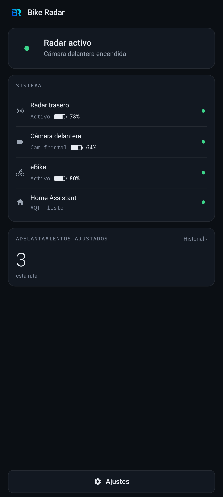
</p>

Funciones principales:

- Radar en pantalla con la distancia, la velocidad de aproximación y la
  posición lateral de cada vehículo; pitidos por nivel y un aviso urgente
  distinto para impacto inminente.
- Recuento de pases cercanos e historial de rutas en el teléfono, sin
  necesidad de Home Assistant: cuenta en la pantalla de inicio los
  adelantamientos que pasan cerca y guarda un historial por ruta (distancia,
  adelantamientos, pases cercanos, y a qué distancia y velocidad pasaron los
  más cercanos), sin ubicación ni recorrido.
- Integración opcional con Home Assistant por MQTT: batería del radar y de la
  cámara delantera, modo de la luz delantera, eventos de pase cercano y resumen
  de fin de ruta (distancia, número de pases, velocidades de aproximación y
  holguras laterales).
- Luz delantera y luz trasera del radar en modo automático según el
  atardecer local.
- Datos en vivo de la eBike Bosch (solo lectura) mientras Bosch Flow está
  activo: velocidad, cadencia, potencia, batería, etc. Nunca envía nada a la
  bici.
- Aviso de cámara olvidada: te avisa si la cámara delantera sigue encendida
  cuando te alejas de la bici después de aparcarla.

El radar funciona por sí solo; Home Assistant, la cámara delantera y la eBike
son opcionales.

## Build

Builds run in Docker so the host only needs `adb`:

```bash
docker build -t bike-radar-builder .
docker run --rm \
  -v "$PWD:/workspace" -u "$(id -u):$(id -g)" \
  -v "$HOME/.cache/bike-radar-gradle:/gradle-cache" \
  -e GRADLE_USER_HOME=/gradle-cache \
  -w /workspace bike-radar-builder \
  ./gradlew assembleDebug --console=plain --no-daemon

adb install -r app/build/outputs/apk/debug/app-debug.apk
```

The first build generates `debug.keystore` at the repo root (gitignored)
and reuses it across rebuilds so `adb install -r` keeps working.

## Releases

Signed APKs are published as GitHub Releases when a tag matching
`v*` is pushed. The release workflow builds from a clean checkout,
signs with a release keystore held as repo secrets, and attaches
the APK to the Release. Releases are published as stable from 1.0.0;
a pre-release cut would flip the `prerelease` flag in the workflow.

To cut a release:

```bash
# Bump versionCode / versionName in app/build.gradle.kts, commit.
git tag vX.Y.Z
git push origin vX.Y.Z
```

The workflow needs these GitHub repo secrets to exist:

- `ANDROID_KEYSTORE_BASE64` - the release keystore, base64-encoded
- `ANDROID_KEYSTORE_PASSWORD` - keystore password
- `ANDROID_KEY_ALIAS` - key alias inside the keystore
- `ANDROID_KEY_PASSWORD` - key password

Local release builds pick the same env variables up from the
shell (with `ANDROID_KEYSTORE_PATH` pointing at the keystore
file on disk) and otherwise fall back to the debug signing config
so the `release` variant can still be built for inspection
without the production key.

## Translating

The UI is fully externalised into Android string resources, so it can be
translated without touching code - Spanish ships in
[`values-es`](app/src/main/res/values-es/strings.xml). To add a language,
fork, create `app/src/main/res/values-<code>/strings.xml`, translate the
text between the tags, and open a PR. Full instructions (placeholders,
plurals, what CI checks) are in [`CONTRIBUTING.md`](CONTRIBUTING.md).

## Contributing & support

Bug reports, ride captures from other radar hardware, translations, and
PRs are welcome - see [`CONTRIBUTING.md`](CONTRIBUTING.md). The project
does not take donations; if you want to help, the most valuable
contributions are a hardware report from a radar the app hasn't seen
before, and protocol corrections in the companion
[`bike-radar-docs`](https://github.com/partymola/bike-radar-docs) repo.

The app speaks the V2 (bonded) BLE rear-radar protocol, and falls back to
the range-only V1 cleartext stream on a radar that exposes no V2
characteristic. See
[`PROTOCOL.md`](https://github.com/partymola/bike-radar-docs/blob/main/PROTOCOL.md)
in the companion repository for the wire protocol, reference decoder,
and unit tests.

## Credits

Map tiles in the hero screenshot are rendered by a separate navigation
app underneath the overlay. Map tiles &copy; Mapbox, map data &copy;
OpenStreetMap contributors. The visible eBike assist-mode indicator
("TURBO") is part of the Bosch eBike Flow UI; Bosch and eBike Flow are
trademarks of Robert Bosch GmbH and their incidental appearance here
does not imply any endorsement.

## License

GPL-3.0-or-later. See [`LICENSE`](./LICENSE).

### Cross-app radar contract (dual-licensed)

The rear-radar IPC interface files under
`app/src/main/aidl/es/jjrh/bikeradar/ipc/` are dual-licensed **Apache-2.0 OR
0BSD** (originated in
[Crazy Capy Randonneur](https://github.com/zingo/CrazyCapyRandonneur)).
This allows any integrating project to adopt them under 0BSD (no obligations)
or Apache-2.0. The Parcelable and binder implementations in this repo remain
GPL-3.0-or-later.
